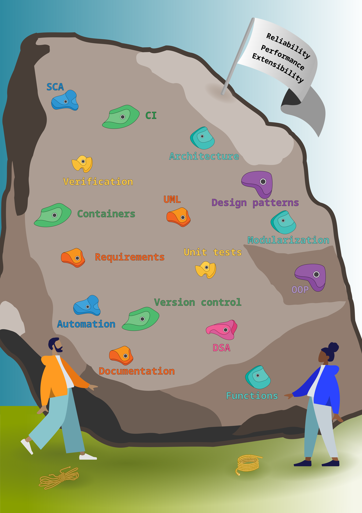

---
title: Improving software quality in bioinformatics groups through teamwork
keywords:
- software quality
- bioinformatics
- teamwork
lang: en-US
date-meta: '2023-12-16'
author-meta:
- Katalin Ferenc
- Ieva Rauluseviciute
- Ladislav Hovan
- Vipin Kumar
- Anthony Mathelier
header-includes: |
  <!--
  Manubot generated metadata rendered from header-includes-template.html.
  Suggest improvements at https://github.com/manubot/manubot/blob/main/manubot/process/header-includes-template.html
  -->
  <meta name="dc.format" content="text/html" />
  <meta property="og:type" content="article" />
  <meta name="dc.title" content="Improving software quality in bioinformatics groups through teamwork" />
  <meta name="citation_title" content="Improving software quality in bioinformatics groups through teamwork" />
  <meta property="og:title" content="Improving software quality in bioinformatics groups through teamwork" />
  <meta property="twitter:title" content="Improving software quality in bioinformatics groups through teamwork" />
  <meta name="dc.date" content="2023-12-16" />
  <meta name="citation_publication_date" content="2023-12-16" />
  <meta property="article:published_time" content="2023-12-16" />
  <meta name="dc.modified" content="2023-12-16T23:07:51+00:00" />
  <meta property="article:modified_time" content="2023-12-16T23:07:51+00:00" />
  <meta name="dc.language" content="en-US" />
  <meta name="citation_language" content="en-US" />
  <meta name="dc.relation.ispartof" content="Manubot" />
  <meta name="dc.publisher" content="Manubot" />
  <meta name="citation_journal_title" content="Manubot" />
  <meta name="citation_technical_report_institution" content="Manubot" />
  <meta name="citation_author" content="Katalin Ferenc" />
  <meta name="citation_author_institution" content="Centre for Molecular Medicine Norway (NCMM), Nordic EMBL Partnership, University of Oslo, 0318 Oslo, Norway" />
  <meta name="citation_author_orcid" content="0000-0002-3006-4297" />
  <meta name="citation_author" content="Ieva Rauluseviciute" />
  <meta name="citation_author_institution" content="Centre for Molecular Medicine Norway (NCMM), Nordic EMBL Partnership, University of Oslo, 0318 Oslo, Norway" />
  <meta name="citation_author_orcid" content="0000-0001-9253-8825" />
  <meta name="citation_author" content="Ladislav Hovan" />
  <meta name="citation_author_institution" content="Centre for Molecular Medicine Norway (NCMM), Nordic EMBL Partnership, University of Oslo, 0318 Oslo, Norway" />
  <meta name="citation_author_orcid" content="0000-0001-8847-9295" />
  <meta name="citation_author" content="Vipin Kumar" />
  <meta name="citation_author_institution" content="Centre for Molecular Medicine Norway (NCMM), Nordic EMBL Partnership, University of Oslo, 0318 Oslo, Norway" />
  <meta name="citation_author" content="Anthony Mathelier" />
  <meta name="citation_author_institution" content="Centre for Molecular Medicine Norway (NCMM), Nordic EMBL Partnership, University of Oslo, 0318 Oslo, Norway" />
  <meta name="citation_author_institution" content="Department of Medical Genetics, Institute of Clinical Medicine, University of Oslo and Oslo University Hospital, Oslo, Norway" />
  <meta name="citation_author_orcid" content="0000-0001-5127-5459" />
  <link rel="canonical" href="https://ferenckata.github.io/SQSeminarPaper/" />
  <meta property="og:url" content="https://ferenckata.github.io/SQSeminarPaper/" />
  <meta property="twitter:url" content="https://ferenckata.github.io/SQSeminarPaper/" />
  <meta name="citation_fulltext_html_url" content="https://ferenckata.github.io/SQSeminarPaper/" />
  <meta name="citation_pdf_url" content="https://ferenckata.github.io/SQSeminarPaper/manuscript.pdf" />
  <link rel="alternate" type="application/pdf" href="https://ferenckata.github.io/SQSeminarPaper/manuscript.pdf" />
  <link rel="alternate" type="text/html" href="https://ferenckata.github.io/SQSeminarPaper/v/3e2fb77da010836e7e9b03eeb5fabf2d04546763/" />
  <meta name="manubot_html_url_versioned" content="https://ferenckata.github.io/SQSeminarPaper/v/3e2fb77da010836e7e9b03eeb5fabf2d04546763/" />
  <meta name="manubot_pdf_url_versioned" content="https://ferenckata.github.io/SQSeminarPaper/v/3e2fb77da010836e7e9b03eeb5fabf2d04546763/manuscript.pdf" />
  <meta property="og:type" content="article" />
  <meta property="twitter:card" content="summary_large_image" />
  <link rel="icon" type="image/png" sizes="192x192" href="https://manubot.org/favicon-192x192.png" />
  <link rel="mask-icon" href="https://manubot.org/safari-pinned-tab.svg" color="#ad1457" />
  <meta name="theme-color" content="#ad1457" />
  <!-- end Manubot generated metadata -->
bibliography:
- content/manual-references.json
manubot-output-bibliography: output/references.json
manubot-output-citekeys: output/citations.tsv
manubot-requests-cache-path: ci/cache/requests-cache
manubot-clear-requests-cache: false
...

<small><em>
This manuscript
([permalink](https://ferenckata.github.io/SQSeminarPaper/v/3e2fb77da010836e7e9b03eeb5fabf2d04546763/))
was automatically generated
from [ferenckata/SQSeminarPaper@3e2fb77](https://github.com/ferenckata/SQSeminarPaper/tree/3e2fb77da010836e7e9b03eeb5fabf2d04546763)
on December 16, 2023.
</em></small>

## Authors

+ **Katalin Ferenc**
  ^[✉](#correspondence)^ 
    {.inline_icon width=16 height=16}
    [0000-0002-3006-4297](https://orcid.org/0000-0002-3006-4297)
    · {.inline_icon width=16 height=16}
    [ferenckata](https://github.com/ferenckata)
     
  <small>
     Centre for Molecular Medicine Norway (NCMM), Nordic EMBL Partnership, University of Oslo, 0318 Oslo, Norway
     · Funded by Grant XXXXXXXX
  </small>

+ **Ieva Rauluseviciute**
   
    {.inline_icon width=16 height=16}
    [0000-0001-9253-8825](https://orcid.org/0000-0001-9253-8825)
    · {.inline_icon width=16 height=16}
    [ievarau](https://github.com/ievarau)
     
  <small>
     Centre for Molecular Medicine Norway (NCMM), Nordic EMBL Partnership, University of Oslo, 0318 Oslo, Norway
  </small>

+ **Ladislav Hovan**
   
    {.inline_icon width=16 height=16}
    [0000-0001-8847-9295](https://orcid.org/0000-0001-8847-9295)
    · {.inline_icon width=16 height=16}
    [ladislav-hovan](https://github.com/ladislav-hovan)
     
  <small>
     Centre for Molecular Medicine Norway (NCMM), Nordic EMBL Partnership, University of Oslo, 0318 Oslo, Norway
  </small>

+ **Vipin Kumar**
   
    · {.inline_icon width=16 height=16}
    [princeps091-binf](https://github.com/princeps091-binf)
     
  <small>
     Centre for Molecular Medicine Norway (NCMM), Nordic EMBL Partnership, University of Oslo, 0318 Oslo, Norway
  </small>

+ **Anthony Mathelier**
  ^[✉](#correspondence)^ 
    {.inline_icon width=16 height=16}
    [0000-0001-5127-5459](https://orcid.org/0000-0001-5127-5459)
     
  <small>
     Centre for Molecular Medicine Norway (NCMM), Nordic EMBL Partnership, University of Oslo, 0318 Oslo, Norway; Department of Medical Genetics, Institute of Clinical Medicine, University of Oslo and Oslo University Hospital, Oslo, Norway
  </small>

::: {#correspondence}
✉ — Correspondence possible via [GitHub Issues](https://github.com/ferenckata/SQSeminarPaper/issues)
or email to
Katalin Ferenc \<k.t.ferenc@ncmm.uio.no\>, 
Anthony Mathelier \<anthony.mathelier@ncmm.uio.no\>.

:::

## Abstract {.page_break_before}

It has been noted multiple times in the past decades that scientific, and more specifically bioinformatics software is developed with less than ideal care and knowledge [@doi:10.1109/mic.2014.88; @doi:10.1109/ms.2007.155; @doi:10.7717/peerj-cs.839; @doi:10.1038/d41586-022-01516-2; @doi:10.1126/science.314.5807.1856].
The consequence of this is code hard to test (or independently verify), reuse, and maintain.
Several groups have suggested solutions to this problem [@doi:10.1093/bib/bbw134; @doi:10.1371/journal.pcbi.1005412; @doi:10.7717/peerj-cs.839; @doi:10.7287/peerj.preprints.2996; @doi:10.1016/j.jmoldx.2017.11.003; @doi:10.12688/f1000research.29032.1], however the issue persists.
We believe the root of inefficiency in implementing best software development practices in the academic settings is the individualistic approach.
Software development is a collective effort in most software-heavy endevours.
The literature suggests that team work directly impacts code quality through knowledge sharing, redundancy, and standards [@https://faculty.washington.edu/ajko/books/cooperative-software-development/].
In our computational biology research groups, we explored ways to sustainably involve all group members in learning, sharing, and discussing software, while maintaining the personal ownership of research projects and related software products.
We found that through weekly meetings, within a year, regular members improved their coding skills, became more efficient bioinformaticians, and obtained a detailed knowledge about the work of their peers.
Through within-group knwoledge transfer, without investing significant amount of time, each member obtained knowledge about advanced concepts, can now quickly identify and access the expertise of each other, and established standards to which new members are also required to comply.
We advocate for improvement of software development culture within bioinformatics through local collective effort, while hoping that top-down approaches such as publication requirements for code become standard in the near future.

## Introduction ##

Bioinformatics and computational biology are continuously gaining importance in biological research.
About 90% of researchers rely on results produced by scientific software [@doi:10.1109/MIC.2014.88].
In turn, scientists are heavily relying on inventions of computer science and software engineering, such as programming languages, programming paradigms, or container solutions.
However, adopting practices from other fields are not without difficulties.
One implication of using outdated or poor software engineering practices is that incorrect software results in invalid scientific findings [@doi:10.1109/MIC.2014.88; @doi:10.7717/peerj-cs.839].
Beyond that, even when the software performs as intended, researchers spend significant amount of time on software building using suboptimal practices which can further increase the necessary time investment in the future [@doi:10.1016/j.jss.2020.110848]. 
Saving time in early development at the expense of future maintenance is known (in the software engineering literature) as accumulation of technical debt [@{https://c2.com/doc/oopsla92.html}; @doi:10.1145/2160718.2160733].

Good software development practices have been established in other software-heavy endeavours to mitigate the risk of incorrect software solutions.
However, bioinformaticians or more generally scientists working with scientific software often lack formal education in computer science or software development [@doi:10.1109/SECSE.2009.5069155; @doi:10.7717/peerj-cs.839; @doi:10.1371/journal.pcbi.1005412].
The lack of theoretical and practical foundations hinders the adoption of good coding practices (e.g. unit tests, continuous integration, code reviews).
To prioritize good practices, it is beneficial to know about the target qualities a software may have.
Altough, the software engineering community has defined software quality attributes [@{https://iso25000.com/index.php/en/iso-25000-standards/iso-25010?limit=3%20}], these are largely unknown to the practicing bioinformaticians.
Among these attributes are functional suitability and performance, which are implicitly prioritized within bioinformatics.
On the other hand, the list also contains usability, reliability, maintanability, and portability, which are implicitly neglected in most bioinformatics endevour.
The consequences of these implicit prioritization is that the default behaviour (i.e. producing protoype software) does not change even when the scope of the software product changes.
For example, bioinformaticians tend to approach data analysis software with the same attitude as tools intended for community usage.

Beyond the limits of individual education, many of the good software practices rely on redundancy of knowledge within team members, supported by practices such as pair programming, regular stand-up meetings, and code reviews.
In contrast, historically, academic research projects are mostly driven by a single person (a PhD student or a post-doc) and these projects are often part of academic degree evaluation.
Unfortunately for software development purposes, the academic world still often tends to disregard the team effort, priding itself on enabling individual achievements and career progression instead.
Taking this into account, with one (or very few) person developing the software for a project, scientific software remains poorly maintained even if it is used by a significant number of researchers worldwide [@doi:10.1101/2022.03.10.483804; @doi:10.1371/journal.pone.0205898; @doi:10.1371/journal.pcbi.1005412; @doi:10.1145/1852786.1852802].

The concept of a team is therefore different in a research-oriented project compared to a software development project.
While the group members help each other with scientific suggestions, most often there is a single responsible person for the design and implementation of the code base.
As official guidelines on coding practices are rarely definitive, but rather suggestive, the actual craft of software engineering is treated as secondary task and is often up to individual judgment.
These guidelines may naturally emerge in larger groups, if software is used or even developed by multiple group members.
It is not always obvious that to follow them requires a form of team organization not intrinsic to academic groups.
To highlight the team aspect, it was reported previously that researchers tended to rank software engineering concepts higher if they worked in a team [@doi:10.1109/SECSE.2009.5069155].
High-profile code bases often feature larger development teams and their activities are marked with longer commit messaged indicating better communication and documentation of the software [@doi:10.1371/journal.pone.0205898].
We hypothesize that a form of team structure organized around individual software products could improve the quality of our scientific code.
Specifically, the development and maintenance of scientific software can be improved by taking into account good software practices.
This can be implemented in research groups by creating a teamwork atmosphere where trainees and staff are directly or indirectly working on the same software.

In this work we start with a literature review on the concepts we build on.
First, we present guidelines suggested by both software engineers evaluating the computational scientists (emphasizing, but not limiting to bioinformatics), and bioinformaticians.
Thus, we obtain an external and internal view on the envisioned standards and priorities for the bioinformatics community.
Next, we explore the main aspect of team management established in non-academic software development settings.
Finally, we describe and discuss how our research groups, motivated and inspired by the literature, created weekly sessions to discuss and learn different aspects of software quality relevant for computational biology.

We find that good practices require investment in time and effort that may not be feasible to fulfill as an individual (e.g. having limited time to perform and to deliver doctoral thesis).
However, we suggest that our practices results in shared standards and an overall better code quality of the members with a reduced effort on an individual level.
These practices include sharing the existing software knowledge base in the group, learning new tool development and implementation together, and normalizing showing and discussing code.
We thus aim to provide a motivation and framework on how to get started with collective software development by directly or indirectly involving all bioinformatician group members, with or without formal training in software engineering.

## Guidelines and practices of bioinformatics as seen by software engineers and bioinformaticians ##

The internet is full of learning and support material for developing or working with software products.
Since bioinformaticians are often self-thought programmers and only a small fraction have formal training in computer science and software engineering, these recourses become vital.
They include blog posts from peers, freely available lecture materials from universities, forums or articles that propose guidelines how to code or analyse data in a better way.
The encouraged practices are plenty and vary a lot, therefore the code produced by bioinformaticians lack a certain standard.
The scientific software status has been analysed by the software engineer community, where certain limitations and caveats were identified and discussed.
We provide an overview of the available literature on these discussion points.

First, let us summarize the main themes in papers with guidelines for bioinformaticians.
These articles would be the entry point for bioinformatician who aim to improve their programming skills.
We used several the phrases to search for papers: “guidelines for bioinformatics software”, and “rules for biologists learning bioinformatics”.
Selected papers focus on specific suggestions, often referred to as rules or “tips & tricks”, or they more broadly direct the readers towards good practices of coding, which are put together into guidelines.
Specialized topics include particular data analysis in a single disease [@doi:10.1186/s13024-022-00517-z], while broad themes span from next-generation sequencing (NGS) data analysis to outlining tips on how to start on computational analysis of the experimental data [@doi:10.1016/j.jtho.2022.11.006;@doi:10.7287/peerj.preprints.2996;@doi:10.1016/j.jmoldx.2017.11.003].
Both types of papers emphasize the need to learn how to analyse data properly and provide good suggestions to do that, based on the chosen topic.
The guideline papers tend to target early career researchers with minimal coding experience (e.g. first time terminal users), while also encourage the usage of state-of-the-art software solutions (e.g. containers).
Therefore, the guidelines might be a mix of basic and advanced concepts, especially from the perspective of a standard computer science and software engineering curriculum.
For example, documentation and version control are most commonly highlighted [@doi:10.1093/bib/bbw134;@doi:10.1371/journal.pcbi.1008645].
However, instructions and tips on how to make your documentation and code up to software quality standards are usually limited, possibly due to the short nature of these guidelines and the lack of sufficient background of the assumed readers.

Next, we performed a second round of literature review to obtain an external view on the status of scientific and whenever possible, bioinformatics software.
The literature search was performed in multiple iterations using Google (to include grey literature) and Google Scholar based on phrases "scientific software development", "software engineering bioinformatics" and "bioinformatics software recommendations" throughout 2023.
Additionally, relevant articles were selected based on the snowball effect from the references of the initial publications.

It is apparent from the literature that software engineers have noticed the separation between software engineering and scientific computing community.
Already almost two decades ago, Diane F. Kelly wrote that scientific computations keep on being performed using error-prone development practices and reaching suboptimal solutions and poor software quality due to lack of appropriate software engineering practices [@doi:10.1109/MS.2007.155].
Therefore, the software engineering community also writes guidelines on how these practices should be followed after surveying the current state of software in scientific community and specifically the bioinformatics community [@doi:10.1016/j.jss.2020.110848; @doi:10.1109/SECSE.2009.5069155; @doi:10.1109/CSEET.2009.44; @doi:10.1145/1852786.1852802; @doi:10.1109/MIC.2014.88].
In addition, an extensive literature review has been published recently in which known issues and suggested solutions are collected [@doi:10.7717/peerj-cs.839].
We collected these recommendations into Table @tbl:sq-recommendations.

| Recommendation          | Source         |
|:-----------------|:-------------:|
| standardised tests | [@doi:10.5281/zenodo.1172970; @doi:10.7717/peerj-cs.839; @doi:10.1109/CSEET.2009.44; @doi:10.1371/journal.pcbi.1005412; @doi:10.1016/j.jss.2020.110848] |
| version control | [@doi:10.5281/zenodo.1172970; @doi:10.7717/peerj-cs.839; @doi:10.1371/journal.pcbi.1005412; @doi:10.1016/j.jss.2020.110848] |
| user (and developer) documentation | [@doi:10.5281/zenodo.1172970; @doi:10.7717/peerj-cs.839; @doi:10.1109/CSEET.2009.44; @doi:10.1371/journal.pcbi.1005412] |
| independent review of source code | [@doi:10.5281/zenodo.1172970; @doi:10.1109/CSEET.2009.44; @doi:10.1109/MIC.2014.8] |
| standardized working environment and automation | [@doi:10.5281/zenodo.1172970; @doi:10.7717/peerj-cs.839] |
| licensing | [@doi:10.5281/zenodo.1172970; @doi:10.1371/journal.pcbi.1005412] |
| requirements gathering | [@doi:10.7717/peerj-cs.839; @doi:10.1109/CSEET.2009.44] |
| containerization for portability | [@doi:10.7717/peerj-cs.839; @doi:10.1371/journal.pcbi.1005412] |
| reuse existing (reliable) software | [@doi:10.1371/journal.pcbi.1005412; @doi:10.1016/j.jss.2020.110848] |
| agile software development methodology | [@doi:10.7717/peerj-cs.839; @doi:10.1016/j.jss.2020.110848] |
| educated choice of software development methodology | [@doi:10.1109/CSEET.2009.44] |
| adoption of international best practice standards of software quality | [@doi:10.5281/zenodo.1172970] |
| establish validation and acceptance procedures | [@doi:10.5281/zenodo.1172970] |
| cooperation between developers and users | [@doi:10.5281/zenodo.1172970] |
| description of the software version used, its configurations and parameters in publications | [@doi:10.5281/zenodo.1172970] |
| preferentially selecting freely available open-source software | [@doi:10.5281/zenodo.1172970] |
| encourage user participation in the software development process | [@doi:10.5281/zenodo.1172970] |
| tagging of software version for reproducibility | [@doi:10.1371/journal.pcbi.1005412] |
| sanity check on input parameters | [@doi:10.1371/journal.pcbi.1005412] |
| do not hard-code changeable parameters and paths | [@doi:10.1371/journal.pcbi.1005412] |
| rely on package managers | [@doi:10.1371/journal.pcbi.1005412] |
| do not require superuser privileges | [@doi:10.1371/journal.pcbi.1005412] |
| provide a small test set | [@doi:10.1371/journal.pcbi.1005412] |
| ensure reproducibility of results | [@doi:10.1371/journal.pcbi.1005412] |
| refactoring | [@doi:10.1016/j.jss.2020.110848] |
| usage of design patterns | [@doi:10.1016/j.jss.2020.110848] |
| quality monitoring (e.g. SonarQube) | [@doi:10.1016/j.jss.2020.110848] |
| continuous integration | [@doi:10.1016/j.jss.2020.110848] |
| contribute to open-source development | [@doi:10.1109/MIC.2014.8] |
| recognition and assignment of adequate time for quality-assured development | [@doi:10.5281/zenodo.1172970; @doi:10.1109/CSEET.2009.44] |
| recognition of software development as academic achievement | [@doi:10.5281/zenodo.1172970; @doi:10.1109/MIC.2014.8] |
| financial support for software development and maintenance | [@doi:10.5281/zenodo.1172970; @doi:10.1109/MIC.2014.8] |
| support for developer community for long term maintenance (when applicable) | [@doi:10.5281/zenodo.1172970; @doi:10.1109/MIC.2014.8] |

Table: Collection of recommendations for improving scientific software quality. Some guidelines are more vague than others, they also have varied scope, and they target different stakeholders. Therefore, it may be hard to find individual responsibility and actionable points from the literature.
{#tbl:sq-recommendations}

The first impression Table @tbl:sq-recommendations might give is being intimidated by the sheer amount of recommendations.
It is unrealistic to expect that a bioinformatician on temporary contract, working towards publishing, without formal training in computer science, or institutional support would be able to gain a good understanding and practice in all of them.
Beyond understanding, Arvanitou et al. note that a scientific software developer needs to prioritize the software quality attributes to make choices among the good practices [@doi:10.1016/j.jss.2020.110848].
They provide a matrix to help with the selection and priorization.
Depending on the application of the scientific software, whether it is a tool or a data analysis pipeline, the authors may prioritize different quality attributes [@doi:10.1016/j.jss.2020.110848].
For example, in the world of big data, performance and efficiency gain importance.
An issue might be, as mentioned above, is that bioinformaticians are rarely familiar with the meaning and importance of software quality attributes.

Therefore, it is not surprising, that the guidelines from software engineers are struggling to penetrate the bioinformatics community [@doi:10.7717/peerj-cs.839].
Among the recommended practices are agile software development, the DRY (don't repeat yourself) principle, requirements gathering and unit testing.
We noted that these concept are not intuitive, well known in the bioinformatics community, or even trivial to adapt to the bioinformatics software development environment [@doi:10.1109/CSEET.2009.44, @doi:10.48550/arXiv.1804.01954; @doi:10.1109/MS.2008.85].
However, it is self-evident that the challenges in adopting good software development practices cannot be an excuse for skipping them.
In the coming paragraphs we highlight some insights about the recommended concepts and practices from the literature review.

One insight was that some advanced concepts, like object-oriented programming (OOP) and extreme programming are known and used in the bioinformatics community, but they are not used to their full power [@doi:10.1109/CSEET.2009.44].
To illustrate this, in case of OOP, bioinformaticians might use classes and inheritance, but rarely encapsulation and polymorphism [@doi:10.1109/CSEET.2009.44].

The hardship of scientific software testing has been also discussed in details [@doi:10.48550/arXiv.1804.01954; @doi:10.1109/MS.2008.85; @doi:10.1109/MIC.2014.88].
Globe emphasized the importance of software testing with an analogy, comparing it to the importance of testing the functionality of a microscope, which is self-evident to all researchers [@doi:10.1109/MIC.2014.88].
In a recent review paper [@doi:10.48550/arXiv.1804.01954] two key aspects of scientific software testing has been highlighted: the oracle problem and the cultural differences between scientists and software engineers.
First, software behaviour can be tested against an expected output, but often in science we use software to find new knowledge.
This results in an oracle problem, when scientists actually do not know *a priori* how the software should behave, thus straight forward verification is impossible.
Second, according to the authors, scientists also view their scientific model and the implementation as a single entity.
Therefore, scientists tend to test the validity of the model but not verify the code which produces it.
Uncovered faults can and do lead to incorrect scientific insights as shown in multiple examples [@doi:10.1126/science.314.5807.1856].

The third insight is about the complexity of bioinformatics software.
In bioinformatics analysis it is common to combine the functionalities that are coming from various packages.
This poses three different problems [@doi:10.1371/journal.pcbi.1005412; @doi:10.1016/j.jss.2020.110848; @doi:10.1109/MIC.2014.8].
First, the package management (including versioning) is a crutial aspect to ensure ease of development, reproducibility, reusability, and maintenance.
In contrasts to mainstream software development, bioinformatics software developers view their code as "means to an end" and care less about the future of the software they are writing.
Bioinformaticians are not well aware of the relationship between complexity, size, age, and the change-proneness of a code, which heavily affect maintainability [@doi:10.1109/CSEET.2009.44].
Frameworks, such as Snakemake [@doi:10.12688/f1000research.29032.1] or Nextflow [@doi:10.1038/nbt.3820] support usability, reliability, and maintainability.
Anaconda [@{https://www.anaconda.com/}] and container solutions [@{https://docs.docker.com/}; @{https://apptainer.org/}] help achieve portability.
These are also compatible with Snakemake and Nextflow, making these frameworks staple for reproducible data analysis.
Second, it is practically impossible to test all functionalities of all modules, and the combinations of various functionalities.
It is therefore instrumental that the developers of the modules are trustworthy and responsible in their development.
It has been shown in a previous study reviewing mappers, that individual tools have varying level of compatibility, usability, and portability [@doi:10.1101/2022.03.10.483804]; quality attributes which directly impact user experience.

A recurring question is whether a script needs refactoring or can remain a prototype.
Taschuk and Wilson [@doi:10.1371/journal.pcbi.1005412] suggest a cut-off where a script is being reused, shared with others or used to produce findings in a publication.
This definition would potentially include the majority of code written by bioinformaticians, but the time spent on improving the scripts should be weighed against the time required to deal with suboptimal code.
Overall, as good practices become routine, the required time investment will be reduced and the benefits will become more apparent.

Finally, to our knowledge bioinformatics literature almost never presents suggestions on how to code in a team setting and utilize multiple people's expertise on software development.
Often guidelines for starting bioinformaticians encourage reaching out to others, but mostly to seek help when encountering a problem with their code.
This could include consulting with colleagues, finding a mentor or participating in online communities (for example, Stack Overflow or Biostars) [@doi:10.1371/journal.pcbi.1008645].
However, it is still mainly focused on individual practices, does not involve peer-pressure, and insufficient to recognize unknown unknowns.
One counter example is the Code Clubs described by Hagan et al..
In their research group members are collectively engaged in software development through code reviews and pair coding and software engineering education through workshops or seminars [@doi:10.1371/journal.pcbi.1008119].
It is in contrary to software engineering-oriented literature, where the main focus is on practices when coding in a team [@https://faculty.washington.edu/ajko/books/cooperative-software-development; @doi:10.1007/s10664-012-9205-0].
Sharing your coding experience with others helps minimize the isolation, allows individuals to learn from their peers, helps to establish and maintain standards, and helps to write a better quality software.

## Coding in team from software engineering perspective ##

Beyond the brief mentioning of getting support or coding in a team in guidelines for bioinformaticians, there is specialized literature that examines how to effectively organize coding activities in a team.
Programming as a collective practice is a key notion in software engineering.
A central theme in this literature is maximizing team cohesion while minimizing code coupling [@{http://www.jstor.org/stable/40539129}].
Authors argue that the viability of a software project along it successive development phases is largely determined by the adoption of sound software design enforcing modularity and extensibility coupled with team management practices centred around communication and collective governance @isbn0932633420.

In general, we understand management as the set of tasks ensuring the viability of a software project.
These tasks revolve around planning, monitoring resources, and tracking progression [@{https://www.wrike.com/project-management-guide/faq/what-is-software-project-management/}].
Typically, the overseeing of these functions would be taken up by a single individual referred to as the “manager” of a project, where manager is a role rather than a title of a particular person.
In the particular context of computational projects in academia, a strict division of labour is rarely found in regard to the management of software projects.
This means that the management and execution of a software project falls into the hands of the same person.
Furthermore, some tasks, such as risk, budget and time management, and maintenance are discussed at the conception of the project (e.g. during grant application) and thus decoupled from the actual software development phase.
The remaining management tasks would often be deliberated by the developer(s), eventually, and often implicitly, reaching a consensus on the desired way forward and acted upon.

This sort of self-management, at times collective, echoes some prescriptions of the SCRUM method [@{https://logicmag.io/clouds/agile-and-the-long-crisis-of-software/}].
SCRUM is a framework to perform these management tasks through team self-management.
This framework was introduced to respond to the aspiration for more autonomy and responsivity from software developers, best illustrated by the agile manifesto [@{https://agilemanifesto.org/}].
This proposition was a reaction to the typical blueprint-like management for engineering projects which proved ineffective in addressing the emerging challenges of large software projects [@{https://logicmag.io/clouds/agile-and-the-long-crisis-of-software/}].
The similarity is probably the reason why agile practices are part of guidelines for scientific software developers (Table @tbl:sq-recommendations).
As agile is the only recommendation about team management, we discuss it here in detail.

Within the context of the software industry, one outstanding aim of agile is the aspiration for more autonomy for organizing the work of software developers.
In the particular context of large computational project, agile opened the opportunity for collective governance and a move away from a project structure producing a division of labour coupling one developer to a particular task or aspect indefinitely.
Incentivizing a collective ownership and governance of the codebase as a whole, promotes the adoption of software engineering best practices among developers contributing to a software project [@doi:10.1016/j.infsof.2009.11.004].
Indeed, by aspiring to make any developer within the team interchangeable across the various ongoing tasks, we create the need for robust testing, comprehensive documentation and coherence across the difference parts of the project [@{http://www.jstor.org/stable/40539129}].
Furthermore, by exposing every developer to a variety of tasks over the course of the project development, we strengthen the knowledge and skill base of the team as a whole, as well as create a better mutual awareness of team member expertise.
This mutual awareness is known as transactive memory system, and has been linked to increased team performance [@doi:10.1177/1046496420967764].
Taken together these merits further improve the team's capacity to overcome technical challenges that will arise over the course of the development process.

The previous paragraph outlined some desirable outcomes of agile-like practices.
Such benefits require the implementation and effective adoption of this mode of project management.
In turn, it relies on the execution of a variety of methods whose success in realizing the merits of agile depends heavily on setting the adequate circumstances for the team to need to incorporate elements of agile in their regular work practice.
Practices and methods aligned with agile prescriptions include stand-up meetings, task allocations, pair-programming, or code reviews.
Note, that many of these practices do not require the presence of the manager, but assumes a collegial work culture and standardized procedures.
At their core, these practices incentivize continuous communication and collective decision-making among developers.
This constitutes an additional overhead in terms of time and resources needed when developing, but this is offset by the aforementioned benefits in terms of coding practice, software resilience and improved team capabilities.

Let us not forget that academia comes from a different place than where agile was developed.
The Agile Manifesto was written against "bureaucracy, infantilization, and sense of futility" [@{https://logicmag.io/clouds/agile-and-the-long-crisis-of-software/}].
In academic software development the agile practices would in fact be a more stringent approach than current practices.
For example it would include writing down requirements in form of user stories, plan a minimal viable product, plan an initial architecture, and divide the project into tasks.
This is important, because most literature pictures agile as management style free from traditional management.
We should not forget that ad-hoc coding does not comply with agile, and we cannot use it as an excuse to continue our current practices.
The agile system assumes that software engineering professionals seek to find the best approaches, and are well equiped to make good decisions on their own - when faced with shifting requirements and complex code base [@{https://logicmag.io/clouds/agile-and-the-long-crisis-of-software/}].
Additionally, the lack of top-to-bottom management, architects and system analysts in academic software development put even more responsibility on the individual developer.
As noted in previous sections, current scientific software developer education does not necessarily cover these elements [@doi:10.1109/CSEET.2009.44].

We do not believe that all the software engineering guidelines employed in the industry are necessarily relevant to the production of scientific software.
The circumstances differ significantly, mainly due to how the outcomes of research projects (papers, tools, protocoles, etc) need to be credited to paricular individual researchers for their career progression.
Regardless of the optimality of this situation, personal projects remain the norm, and it would be futile to expect another group member to achieve an equal level of familiarity with one's project.
However, this should not prevent interactions between the people in the group, as it is through these interactions that rules are enforced and quality increased.

In our research groups, we have practically implemented the environment in which we, as a group, learn about and implement software quality practices that have been discussed in literature.
We want to share this experience and propose how simple additions, such as weekly code review sessions or seminars, can lead to improved quality collective or personal software.

## Our experiences for development processes involving teams ##

We have seen a wide variety of suggestions in the literature aiming to improve the status of bioinformatics software.
We recognized that for a single person achieving a good understanding of them all, and subsequently prioritizing, and adopting them would require a substantial amount of time.
In some cases (e.g. standardized environment, independent review of source code) it is even impossible to implement as a single person.
We also have seen that the industry standard approach heavily relies on a team structure and team management.
Therefore, within our groups, we aimed to create a system where the individual scientific software projects are supported through collective learning, understanding, and discussions.
Here, we describe the practices that we have settled on.

The software development practices that we have adopted can be broadly separated into three categories: what we have called software quality meetings, code reviews, and resource sharing.
We intend these as an exemplatory approach for other computational biology groups or institutes of 5 or more bioinformaticians.
However, given the abundance of opinions on this topic, and the variety of challenges bioinformaticians face, we believe that each group should find out what works best for them.

### Software quality meetings ###

Within the framework of software quality meetings, we have established a large-scale knowledge transfer system between the participants.
Presentations and demonstrations of basic concepts, new techniques and tools that are not necessarily tied to a specific project help broaden our knowledge base and awareness.
In this sense, they form almost a substitute for a more formal computer science education, which most bioinformaticians lack [@doi:10.7717/peerj-cs.839].
Topics can arise from literature recommendations, previous education, own projects, code reviews, or effectively be a reproduction of a useful talk or seminar given elsewhere.
The presenters benefit as well by having to research the topic further and present it coherently.
It is not necessary to held these meetings as regularly as code reviews, especially as the time investment may be taxing for the presenting individual.
However, we recommend keeping them regular, e.g. at least once a month, given the amount of knowledge that can be learnt together (see Table @tbl:sq-recommendations).

The outcome of these sessions are manifold.
A few examples: 
1) a shared vocabulary that enables quick discussion about implementation details and code structures (e.g. object-oriented programming, design patterns, data structures and algorithms), 
2) a kind of toolkit and set of recordings we can sample from and build on in our own research projects (e.g. containerization, git features to ease and quicken software development, planning with UML diagrams),
3) awareness of previously unknown packages, improving software performance and quality (e.g. bioframe, S4 object system, R Markdown).

During the software quality meetings, we have also explored the possibility of collaborative projects and pair programming, but have not managed to implement it successfully yet outside the scope of preparation for the JASPAR 2024 release [@doi:10.1093/nar/gkad1059].
We experimented with collaboration on a software tool not directly used by any of the members (see section on Resource sharing).
However, we found we could not afford to invest sufficient amount of time in a coding practice.

### Code reviews ###

Code reviews are not a new invention and many people have discussed their benefits [@doi:10.5334/jors.35; @doi:10.1371/journal.pcbi.1008119; @{https://logicmag.io/clouds/agile-and-the-long-crisis-of-software/}].
Here we would just like to briefly summarize how being made to present your code and receiving feedback leads to improvement in the process of creating software.
We found that during these meetings implicit peer-pressure helps us achieve most goals: standardization of practices, improved code quality, and enhanced usability of the software.
We would like to note, that the efficiency of these meetings require a shared understanding of the concepts covered during the software quality meetings.
Therefore, we advise starting with learning before discussing the code.

Prior to a scheduled code review, the author is expected to write their code in a way that it will be explainable and understood by others.
This expectation is largely self-inflicted as each person feel the pressure of exposing their weaknesses - even within a friendly environment.
In a large distributed project clean coding style may be trivial, but because the bioinformatic projects are often handled by a single person, it is very possible to make the code complex and obfuscated.
We observed that during data analysis parts of the code are re-run in an ad-hoc manner (e.g. by commenting out or re-writing parts), making it increasingly difficult to explain the code or reproduce the same analysis.

During the code review, the author has to explain some aspect of their code clearly (e.g. structure, algorithm implementation, performance related decisions), which depends on them understanding it.
Trying to explain your code to someone is shown to help with understanding, as with the rubber duck method [@ISBN:9780201616224].
The feedback obtained can help fix existing or potential future issues, improve the implementation, and produce cleaner, more concise code.
The other participants may not be deeply familiar with the particular project, but they have their unique knowledge and point of view.
We agree with the ten simple rules described by Hagan et al. [@doi:10.1371/journal.pcbi.1008119], and note that many of those naturally emerged as a code of conduct after a few rounds of trial and error.
In our settings, it is entirely up to the author to choose which aspect of the code, or software product to discuss.
Although it is implied that participants of code reviews are intended to discuss implementation details, we accept and enjoy discussions around any other aspect of the code, such as user interface design, documentation, or architecture considerations.

After the review, the received suggestions, if crucial, should be implemented swiftly to improve the code before advancing the project.
Some other suggestions (e.g. coding style) do not require instant refactoring, these may be viewed as suggestions for future projects.
Recurring comments were made about modularization, documentation, and variable declarations, until these became standard among the members.
For example, after about half a year, it was trivial for everyone involved that code organized into functions is preferred over spaghetti.
Older, discontinued project code may not comply with these standards, but any new code follows them.
The success of code review is highly dependent on its frequency.
A long time between reviews means a lot of new code, difficulty to cover all changes in a single session, and potentially a lot of rewrite post review.
This means that code reviews should be as regular and frequent as reasonably possible.

Our experience indicate a broader adoption of notions and good software engineering practices highlighted during these code review sessions.
Here we will focus on couple examples to illustrate how code reviews incentivised coding practices and team self-managements aligned with agile prescriptions.
Code review involves some elements of problem solving, often revisiting fundamental notions of design patterns, algorithms or data structures. 
Recurringly we would examine best strategies to modularise the presented code and discuss what would consitute effective and self-contained computational task and elaborate collectively possible design patterns.
This strengthens the team's overall competency as well as promoting some form of standardization regarding the mental models to use for common tasks and objects solicited in many computational projects.
An important part of the code review process focuses on the compliance with good code practices, and constitutes an explicit attempt at standardization. 
This is particularly well illustrated with the review of documentation which goes beyond simple linting. 
Effectively this process promotes the adoption of a shared and systematic manner to describe and document the behavior of the considered tool, which facilitates its intelligibility for a wider audience.
The shared knowledge base and standards also allow us to make new group members adopt good coding practices more quickly.

As a positive additional outcome, we noticed an increasing understanding in each other’s projects that naturally emerged through talking about the analysis code.
This enabled us to give more involved comments during subsequent group meetings too, where we would naturally discuss each other's scientific projects.
We noted however, that the focus can easily shift from the code to the biological question at hand.
We believe this is more of a feature than a bug, as the software solution heavily depends on the domain knowlegde and question at hand.

### Resource sharing ###

Resource sharing boils down to making sure that useful online resources are brought to the attention of all participants easily.
It can be discussed from two perspectives: external open-access resources (forums, repositories, packages and libraries) and internal (within-group resources with tools).
The latter is very important as it allows for team contribution that can benefit the individual project development.
A simple example of this could be a shared repository of various computational tools that were developed by members of the group.
Such tools are universal enough and fit the group’s research questions, so all people in the group can re-use them.
In addition, each tool can be potentially developed and reviewed by multiple group members.

During software meetings, we aimed to set aside time to improve these tools from perspectives identified by the members.
We observed that many of these tools do not have a clear scope and are rather a small script for a sub-task from a previous project.
Based on this observation, we noted that there is a difference between a script and a standalone tool that can be inserted into various projects.
The latter requires exploration of use cases related to the tool, handling of unexpected input, and extensive documentation, to name a few tasks.
This understanding was actually quite relevant in a code review discussion when the expected usage modes of a new tool was the main focus.
We aim to include this knowledge in the upcoming events when a new tool is added to the shared repository.

### Summary ###

We have chosen to illustrate the process of improvement in software writing by comparing it to rock climbing.
At the top of the rock is our goal of good quality software.
Specifically, we identified reliable, performant, and extensible software as our aim.
In order to reach it, we need to become proficient in the various concepts depicted by the holds.
The higher they are on the wall, the more advanced we consider the concepts to be.
As the progress is gradual, we have chosen to show the holds in the same colour if they represent related concepts that build upon each other.
This way, we mimic traditional CS education, compared to the guidelines of a mixture of concepts.
The most important point, however, is the fact that rock climbing requires a partner to belay you, just as we believe the input of other people helps us become better programmers. 

(Figure @fig:climbing-figure)

{height="700px"}{#fig:climbing-figure}

As an example, we used our experience from these sessions, during the update of the curation analysis software of the 2024 release of the JASPAR database [@doi:10.1093/nar/gkad1059].
In this project, as well as in some of our own individual research projects, we adopted object-oriented programming style, introduced user stories when documenting the requirements and assumptions, relied on Jira to add features and report bugs, and we established continuous integration with git.
Beyond the technical solutions, we also assigned tasks and adopted code reviews for each pull request.
The reduced treshold of adopting new practices enabled us to follow a team-based software development practice in this project with little to no prior experience.

## Conclusions and future perspectives ##
(From Ieva: I would call this conclusions and future perspectives and would keep the section sharp and short.)

Software engineering emerged and has been developing to address issues naturally arising from poorly planned software development, such as project failures, delays, incorrect functionality or defects [@doi:10.1145/3084225], none of which is unknown to the scientific community.
Indeed, the crisis of scientific software in general is widely discussed [@doi:10.1038/d41586-023-00053-w; @doi:10.1038/d41586-022-01516-2].
It is only natural that the bioinformatics community learns from those more experienced, solving problems that have been identified.
In this case, it is both the software engineering research community and the industry experts on software and team management.

In our computational biology groups, we introduced regular seminars to learn about software solutions, and code reviews that fits our specific needs and context.
Through these meetings, we learnt about and adopted various concepts that achieve a better quality software, with special focus on reliability, performance and extensibility.
Furthermore, we have established coding standards within our groups, which ease within-group support and collaborative projects.
We note that the usage of these tools is not necessarily aligned with industry practices, due to the experimental nature of scientific software.
Nevertheless, as bioinformatics becomes a more and more software-heavy field, we believe a good direction is to collectively lower the barrier to adapting to new technologies.

An emerging notion from our experience with introducing software engineering practices into our bioinformatics work, is the distinct yet integral part played by software development in the scientific research process. 
Beyond the technical challenges of concretely implementing a particular computational analysis, the software design choices shaping the implementation reflect actual scientific assumptions about our mental representation of the investigated object. 
Thus the choice of data-structures, integration with particular suite of computational tools, file system to adopt, etc. play an as decisive scientific role in a research project as the choice of model system, protocole optimisation or control experiments do. 
Both these experimental and computational decisions will determine the questions we can address with the data produced by our experiment.

When discussing our approach, it is implied that team dynamic is important, especially for such bottom-up approaches.
Huckman et al. found that the overall performance increases when team members are familiar with each other and build problem-solving routines together through cumulative experience [@{http://www.jstor.org/stable/40539129}].
When there is a group of developers already, knowledge on who knows what (see: transactive memory system) speeds up problem solving [@doi:10.1177/1046496420967764].
Time and social factors ease technical knowledge transfer [@{http://www.jstor.org/stable/40539129}].
Miriam Posner also points out that team management practices do not protect from a toxic environment [@{https://logicmag.io/clouds/agile-and-the-long-crisis-of-software/}].
We therefore recommend to group leaders motivated in establishing coding standards within their groups to prioritize building a well functioning team.

We envision a future where scientific software for core applications is appreciated, reliable, and actively maintained.
We believe all scientists would benefit from a strong backbone of software solutions, that would support quick and efficient prototyping, as well as maturation of working solutions.
There are necessary steps to achieve this vision [@doi:10.1109/mic.2014.88; @doi:10.1038/d41586-022-01901-x; @doi:10.5281/zenodo.1172970; @doi:10.1109/MIC.2014.8; @doi:10.1109/CSEET.2009.44].
We discuss these below.

The lack of funding for the maintenance of software, particularly scientific software, prevents achieving a level of software quality that would inspire confidence in the results [@doi:10.1109/MIC.2014.88].
Funding is typically provided for the development of novel software, and it can be hard to justify spending time on maintenance which provides no output in terms of articles.
Currently, as Alexander Szalay puts it "The funding stops when they (researchers) actually develop the software prototype" [@doi:10.1038/d41586-022-01901-x].
This is a problem, because future researchers would want to build on each other's findings, use previous software as tools, and spend less time adopting or maintaining software [@doi:10.1371/journal.pcbi.1005412; @doi:10.1016/j.jss.2020.110848; @doi:10.1109/MIC.2014.8].
We believe the infrastructure would benefit from funding earmarked for maintenance, and from dedicating time to it in project proposals.
Fortunately in recent years, the lack of funding is being recognized and addressed by a few agencies, such as the Chan Zuckerberg Initiative Essential Open Source Software for Science fund [@{https://chanzuckerberg.com/eoss/}].
Scientific community and funding agencies should welcome the efforts of maintaining original software and encourage its updates instead of the development of a replacement software that risks remaining unmaintained.

Working in teams is not an option, but a must for large projects which support thousands of reserachers world-wide, and contribute to novel findings.
There is an increasing amount of such projects for next generation sequencing, single-cell analysis, and correlation studies, to name a few.
Although it is not necessary in smaller projects, the benefits are significant.
These benefits include the following.
First and foremost, all software project start as small prototype-like software.
The fate of these can be varied.
Either they are abandoned by the original developer.
They could also technically survive the original developer, depositied on platforms like GitHub, but they might be overly cryptic and poorly documented so that no other scientist can take over [@doi:10.1038/d41586-022-01901-x].
Over time a small project might be taken over by another person, thus accidentally becoming a sort of team project with (by definition) insufficient communication.
Lack of standards and good practices undermine maturation, addition of new features, and general maintainability, thus may prevent a smart solution to be used and reused over time.

Agile development can be a way forward, as the most fitting team management format for academic usage.
- Comparison to current academic coding
    - agile would be more stringent
    - agile would challenge the one project : one developer configuration
    - agile would highlight the impossibility to capitalise dividends of long-term building of knowlegebase and team chemistry
    - agile would point at the training gap

- Approaches and circumstances promoting the benefits of agile

- Cost-Benefit of adoption

## Discussion ##
(From Kata: bit unsure about the content here.)

## References {.page_break_before}

<!-- Explicitly insert bibliography here -->

